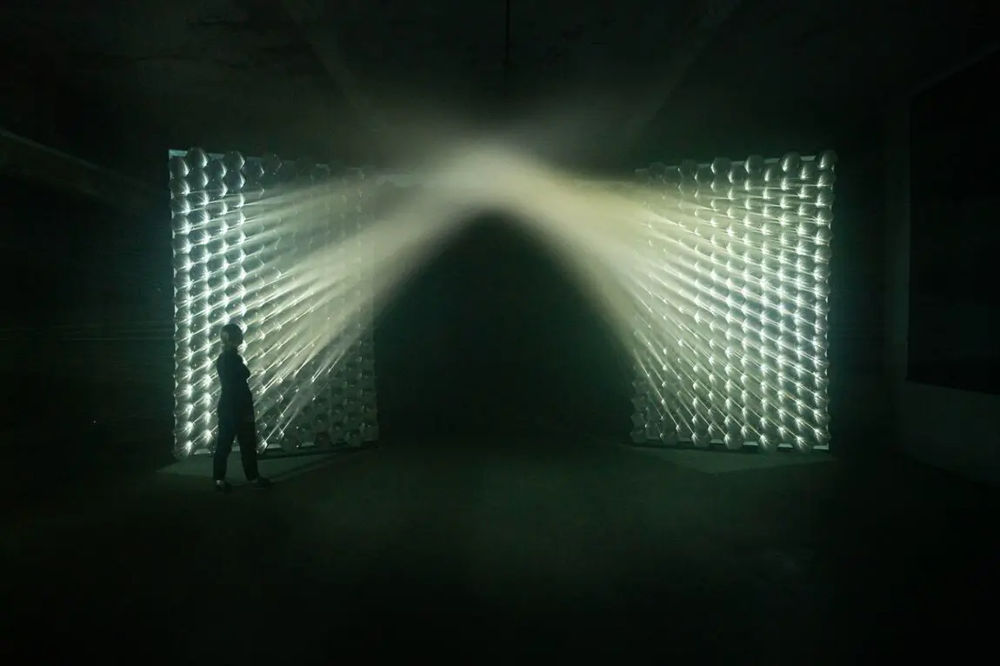
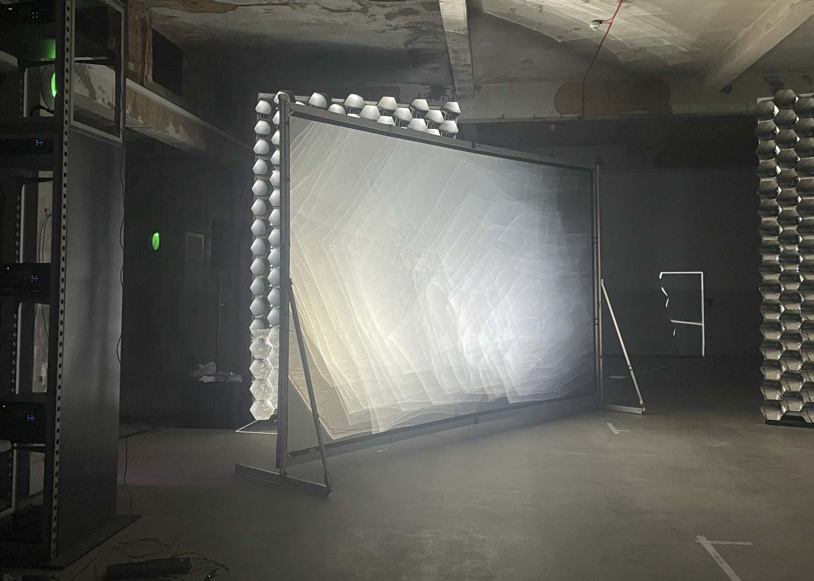

Artist Assistance for Studio Kimchi and Chips with Rosa Menkman at Thin Air, The Beams. Exhibition displayed March - June 2023. Responsibilities: graphics generation, development and rendering, calibration assistance, runner.

 

||
|:--:| 
|Installation image, 2023 - Cyclops Retina, Light Barrier 2.4 © The Beams, Centre for New Culture.|

I assisted in the calibration of their curved mirror array installation, and the development of film for use in the final projection.

This iteration of ‘[Light Barrier](https://www.kimchiandchips.com/works/lightbarrier/)’ by Kimchi & Chips was realised in collaboration with Rosa Menkman, an artist known for her work with [glitch](https://beyondresolution.info/PORTFOLIO). This instance employs narrative and graphics, differing from previous instances of Light Barrier. 

<b>Demo Footage:</b>

    

        <iframe title="vimeo-player" src="https://player.vimeo.com/video/816548874?h=6d825b4d47" class="v_video" frameborder="0" allowfullscreen></iframe> 
        <iframe title="vimeo-player" src="https://player.vimeo.com/video/816548733?h=7d4a7fa1a5" class="v_video" frameborder="0" allowfullscreen></iframe>
        <iframe title="vimeo-player" src="https://player.vimeo.com/video/816549516?h=1e880343c9" class="v_video" frameborder="0" allowfullscreen></iframe>
        
 The resultant 3 videos above, projected by the Light Barrier system were created using Adobe After Effects and Premiere Pro. 

    
 
    <iframe title="vimeo-player" src="https://player.vimeo.com/video/816545499?h=5dbbfdc168" class="h_video" frameborder="0" allowfullscreen></iframe> 

 

The system uses approx. 380 concave mirrors that each project light at calibrated angles into the space. Each mirror receives an image adjusted for its vector space from a projector. Light is collected where the beams converge, rendering an image. Testing for this vector space required test patterns to be fired and detected for each mirror in series at two different points in physical space, with custom software used to resolve the image transform required to be fed to a shader.

*[no images were taken during calibration due to the photosensitive nature of the process - no additional light was allowed in the space during calibration periods, to ensure measurement accuracy.]*  
  
 

 

||
|:--:| 
|Screen placement during calibration phase.|

<b>Prototyping imagery:</b>

During this stage I used A1111 to generate example footage, which I combined with ControlNet to generate depth maps to create 3D scenes from 2D imagery. We needed to test how effectively different forms, tones, line weights and textures would display with the projection system, so I began with this video of a horse as a placeholder whilst we figured out a working methodology. This was generated with video and text inputs according to a stable diffusion model from [Civitai](https://civitai.com/).

    <iframe title="vimeo-player" src="https://player.vimeo.com/video/816643639?h=ea765e4aea" class="h_video" frameborder="0" allowfullscreen></iframe> 

