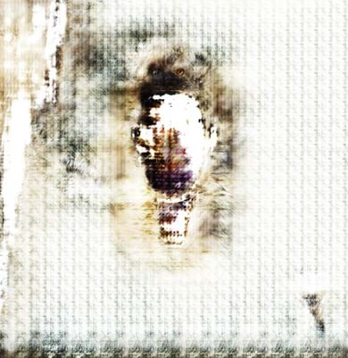

A collection of Machine Learning browser application demos. Code for each can be found in my repository <a href="https://github.com/david-rollinson/ML-Creative-Applications-Demos">here</a>.

<!-- Tags: API, Google Teachable Machine, HTML, Javascript, ML -->

 
    

        
        
    

    Captured images from Pix2Pix demo sketch programmed in p5.js and ml5.js. See demo 1 below.

## **>PoseNet, Image Filtering and Pix2Pix (Demo 1):**

<iframe title="vimeo-player" src="https://player.vimeo.com/video/790778551?h=d95398ec1f" class="h_video" frameborder="0" allowfullscreen></iframe> 

This sketch implements both PoseNet and Pix2Pix machine learning technologies in one. The user can draw to the screen with their body, and run Pix2Pix to translate the drawing into a more textural image.

The webcam is used with PoseNet to detect the coordinates of the shoulders and arms of the user, drawing their movements to the screen. I modelled the motion of a double pendulum - with the lowest bob of the pendulum also drawing to the canvas - to add greater uncertainty to the resultant drawing. Once the canvas has been sufficiently drawn upon, the canvas can be captured in order to run a Pix2Pix algorithm, that translates the drawing into different textures and forms. 

## **>Sound Classification (Demo 2):**

<iframe title="vimeo-player" src="https://player.vimeo.com/video/790599868?h=1cfc4c4ac3" class="h_video" frameborder="0" allowfullscreen></iframe> 

This sketch uses a sound classification ML model trained with Google Teachable Machine. I trained the model to classify and label ten onomatopoeic sounds, which I recorded by striking or scraping a range of objects and then manually inputting their related labels:

*Argh, Bang, Buzz, Clap, Click, Clink, Crash, Pop, Scrape, Tap.*

 

||
|:--:|
|Screenshot during Google Teachable Machine sound classifier training process.|

The program uses the built-in microphone to detect sound and classifies what it hears according to the ten labels. Once classified, in response the program plays back a sound from a selection of samples from a preloaded [Splice sample pack](https://splice.com/sounds/packs/splice/sophie-samples/samples?utm_source=google&utm_medium=cpc&utm_campaign=row-en_multi_gs_ua_sounds_20220602_nonbrand-dsa_allprimary&utm_content=sounds&utm_term=&campaignid=13577111017&adgroupid=123041963439&adid=528665014280&gclid=CjwKCAiAoL6eBhA3EiwAXDom5nR3LzTJzN24bbgtjYVLrYHJREt75wxJPjdlNNp8s9i1jbPX-HrqmBoCrVwQAvD_BwE). The program then uses the Giphy API to search the internet for a GIF related to the sound’s label, and draws it along with the sound’s label to the screen. To the left of the sound label is the confidence level of the classifier.

The Google Teachable Machine sound classification model that I trained can be viewed [here](https://teachablemachine.withgoogle.com/models/I1HCqNEV5/).